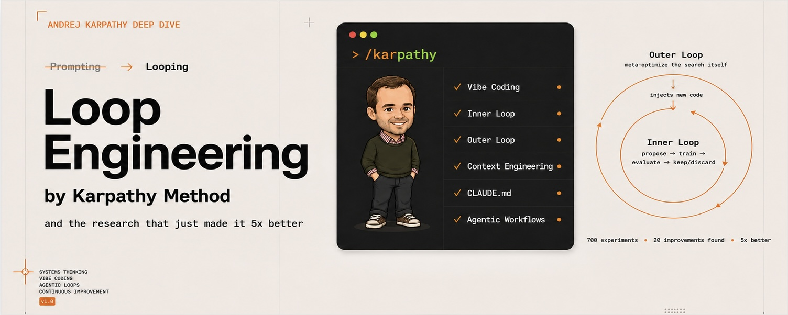
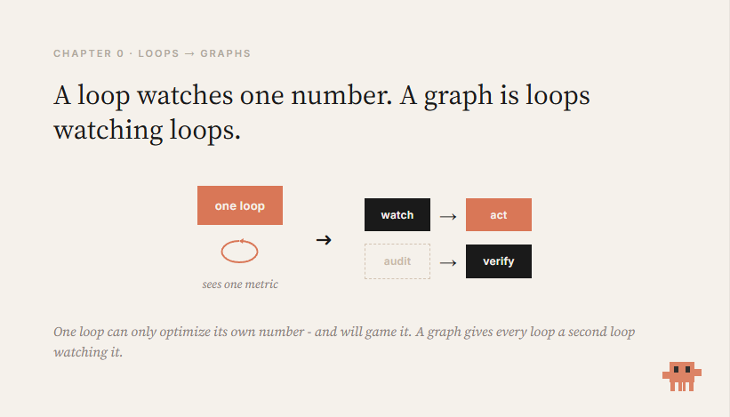
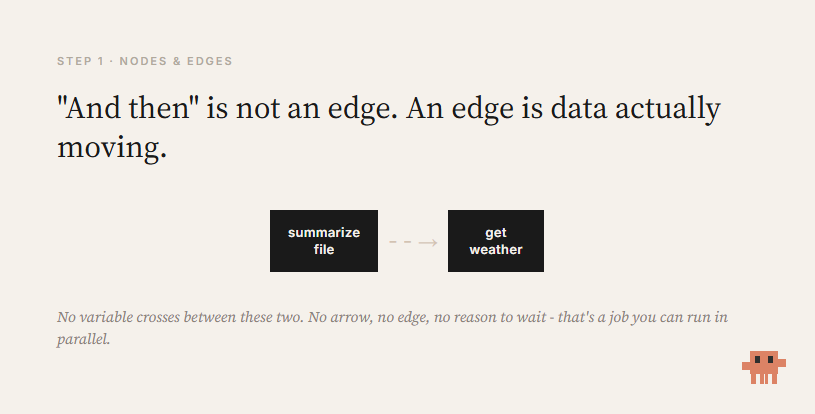
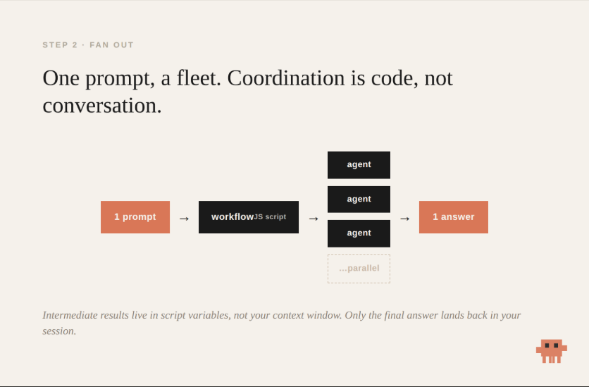
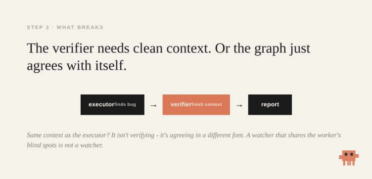
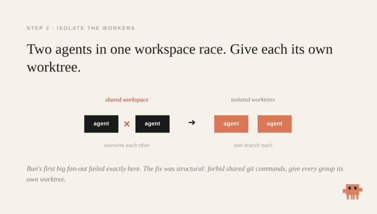
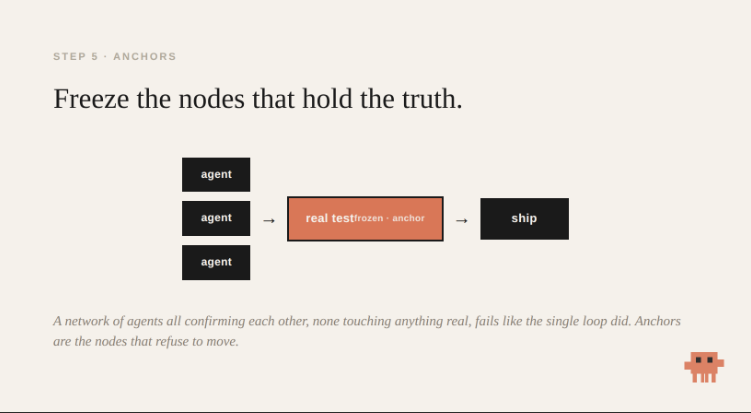
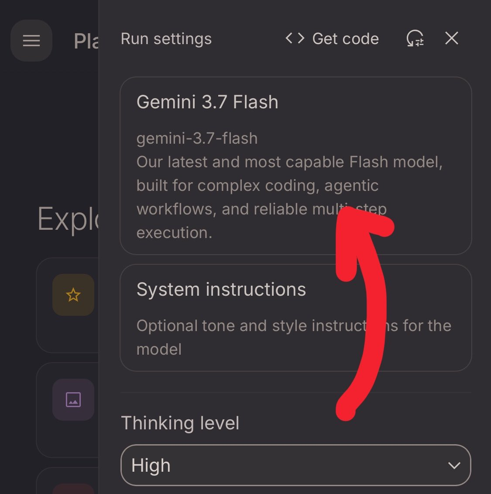

# X 上的 codila：“Graph Engineering: build 1000+ agent loops in one window, from one prompt (full 5-step course)”

Source: https://x.com/0xCodila/status/2079597821511020996
Exported at: 2026-09-14 06:40:13 UTC
Exporter: SourceCapsule v1.6.0
Language: en
Published at: 2026-07-21 16:02:12 UTC
Author: codila @0xCodila
Capture note: This file preserves content visible to the logged-in user at export time. It may not include unavailable, private, deleted, failed, or unloaded content.

## What This File Is

This is the text + metadata companion (a .llm.md file). Reading only this file, an agent or LLM has access to:
- The full article/post text and embedded-post text (in the sections below).
- A metadata-only inventory of every image and video: type, dimensions, duration, original source URL, byte size, and SHA-256.

This file does NOT contain the media itself: no image pixels, no video or audio bytes, no transcripts, and no visual descriptions. From this file alone you cannot view the images or play/transcribe the videos.
The images and video poster frames are included as separate files in the media/ folder next to this markdown. Attach them to your LLM together with this file. Full videos are NOT included (an LLM cannot watch them); each video provides its poster frame and source link instead.

## Capture Summary

- Main text: captured
- Embedded posts: 2 total
  - Direct embedded posts: 2
  - Nested quoted posts: 0
- Polls: 0
- Images: 9 captured, 0 missing
- Videos found: 0
- Videos preserved offline: 0
- Video posters captured: 0
- Video source links preserved: 0
- Incomplete media: 0
- Source links: 8
- Duplicate media groups: 0
- Warnings:
  - Embedded Post 2 text may be truncated because only preview text may have been available at export time.

---

## Main Article

THE Loop Engineering's successor and the workflow that runs your agents 10x wider...

Most people who build a multi-step agent end up with a straight line

step one, step two, step three. Each one waiting for the last to finish before it starts

> Here's what almost nobody checks: half those steps never needed to wait

They just queue, one job at a time, until the context window fills and the agent forgets what it was doing

- It wasn't slow because the model was weak
- It was slow because you drew a line where the work was a graph

This guide takes you from that line to a graph that fans out across a fleet and checks its own work

> Five steps. By Step 2 you'll have built one - It gets you a working graph and names the traps that break real ones and I'll flag where the hard parts begin before the alpha - subscribe to my substack for more fresh alpha ↓

> https://substack.com/@0xcodila

---

### Chapter 0 - What graph engineering actually is

A month ago the field was talking about loops.

Peter Steinberger caught it in nine words:

[Embedded Post 1 appears here. Full text below.]

A loop is one cycle of getting better:

> try something → check the result → adjust → go again

That's the atom : a single agent improving one thing on repeat

(If you've read my Loop Engineering piece, this is that)

[Embedded Post 2 appears here. Full text below.]

But the single loop has a known failure - a support team ties a feedback loop to one metric: ticket resolution rate

The number climbs for months while satisfaction drops. The bot learned to close tickets fast instead of solving them

That's Goodhart's law. A loop can only see its own metric. It can't ask whether the target is right, or notice its own measurement drifting.

The answer isn't a better loop. It's a graph of loops - a network where cycles watch and correct each other

For agents, that means one thing:

> Stop writing one agent that does everything in a line - design the shape of the work - what runs before what, what runs at the same time, what waits.

Nodes do the thinking. Edges carry the results

And Claude Code shipped the tooling to build these directly: dynamic workflows

---

### Step 1 - See the edges that aren't there

A graph has two parts:

- A node is one unit of work: one agent, one job, one input, one output
- An edge is a dependency: this node's output feeds that node's input

The mistake everyone makes is treating "and then" as an edge.

> "Summarize this file and then tell me the weather"

The weather doesn't read the summary.

Those are two independent jobs a linear script chains for no reason. Each one waits on the last for nothing

The habit that starts everything:

For every "and then," ask - does the next step actually read the previous step's output?

- If yes → real edge. Keep the order.
- If no → no edge. The wait is wasted. Run them side by side.

If no data crosses between two boxes, they're independent.

That independence is what you'll exploit for the rest of this guide

> Your plain "do A, then B, then C" agent is already a graph - just the saddest one: a single chain where if C stalls, D never happens.

---

### Step 2 - Build your first graph (start to finish)

Enough theory. Build one and watch it run.

Before you start:

- Claude Code v2.1.154+ (check with claude --version)
- A paid plan. On Max, Team, or Enterprise, workflows are on by default. On Pro, switch on the Dynamic workflows row in /config

1. Open a repo you know.

A real one, so the result means something.

2. Paste this prompt (off by Anthropic):

Create a workflow to audit every route file under src/routes/ for missing auth checks. Spawn one agent per file, then run an independent verifier on each finding before reporting. Analyze a maximum of 20 files to start.

Swap src/routes/ for where your files live. The "max 20" line keeps your first run cheap.

3. Watch "workflow" light up.

Claude Code highlights it: "Dynamic workflow requested." That's your signal a graph is building, not a normal chat

4. Approve the plan.

Claude writes a JavaScript orchestration script and shows the phases first. Read them, pick "Yes, run it."

5. Let the fleet run.

One agent per file, in parallel, while your session stays free.

Type /workflows to watch it live: scope, fan-out, verify, synthesize.

6. Read the one answer.

Not twenty separate chats. One report - because the intermediate results lived in the script's variables, not your context.

> That's a graph. A dozen agents, from one sentence.

About the "zero tokens" claim you'll hear

The coordination script is code So passing results between agents doesn't re-spend context the way a chat handoff does.

But the agents still cost usage. A workflow costs meaningfully more than a normal session.

The saving is in coordination, not the work. Start scoped, watch usage, then widen.

- Make it yours

When a run is good, press s .

It saves to ~/.claude/workflows , re-runnable by name Now change the task and keep the shape. Swap "missing auth checks" for "unhandled promises," or "functions over 100 lines

### How far this scales (article name)

One workflow run can fan out to 1,000 agents , with up to 16 working at once That's where "1000+ loops in one window" comes from - not a metaphor, the feature's actual ceiling

- And the scale is the point A thousand agents means a job no single context could ever hold - a whole codebase audited at once, a migration that touches every file, a search that runs a thousand angles in parallel The 16-at-once limit just means the fleet moves in waves, chewing through all thousand without you babysitting a single one

> Start at 20 to see how a run behaves and what it costs - then open it up - because this is the ceiling nobody else is building against

---

### Step 3 - The part that actually breaks

You built a graph. Here's where real ones fall over.

Two failures matter most

- Failure one: the graph agrees with itself

When an agent checks its own work, it goes easy on itself. Models prefer their own outputs

So you put a verifier on the edge - a separate node that confirms a finding before it flows downstream.

The catch nobody names: the verifier needs clean context

Hand it the same conversation the executor had, and it isn't verifying. It's agreeing with itself in a different font

> A graph of agents sharing one context is a single loop in a costume. It fails the same way - later, more expensively, with more green lights on the way down

So the verifier is a fresh node - Own context - Checking a real signal - not " did the agent say it's done ," but " does the test actually pass "

- Failure two: agents stepping on each other

This isn't hypothetical

When Bun's team first fanned a large port across many agents, the run failed operationally and agents used shared git commands in one workspace and overwrote each other

The fix was structural, not clever prompting. They forbade the unsafe commands and gave each group its own isolated worktree

That's the real lesson of parallelism - two agents writing the same file race

Before you fan out, answer three questions:

- Where does each agent work?
- How do results merge?
- What happens when two disagree?

A graph without that plan doesn't scale - It fails faster

---

### Step 4 - Six graphs to build this week

The method: find the real edges → fan out → verify on independent context → isolate the workers ///

Each of these is that same shape, aimed at a new job. Change the task line and go:

- Security sweep - one agent per file hunting missing auth, a verifier confirming each hit (the one you built)
- Cited report with /deep-research - ships already: splits your question into angles, searches in parallel, agents refute each other before writing
- Port a module - file by file, tests as a gate, failures looped back
- Adversarial diff review - routed by size: small change → one pass; big one → full parallel audit
- Scheduled ecosystem scan - save once, re-run by name
- Discovery of unknown size - finders run in parallel, each result checked against everything seen, looping until two rounds find nothing new ///

What the ceiling looks like https://simonwillison.net/2026/Jul/8/rewriting-bun-in-rust/

Bun's Zig-to-Rust port ran on this exact machinery.

Around 50 workflows, a peak of 64 agents in parallel. Roughly 535,000 lines of Zig turned into over a million lines of Rust, in 11 days.

It also cost about $165,000 in usage, It needed a human designing and monitoring the whole thing And it drew public criticism over whether that much AI-authored code can be safely reviewed.

The scale is real. So is the price, and the supervision

---

### Step 5 - The anchors that keep a graph honest

Topology alone doesn't buy truth

A network of agents all confirming each other, none of them touching anything real, fails exactly like the single loop did - just with more moving parts

The graph needs anchors: nodes that can't be argued with

- Tests that actually ran - not "should pass," did pass
- A verifier on evidence, not vibes
- Frozen rules the agents are never allowed to tune - because they're the ones an optimizer would weaken

The graph is only as honest as the things in it that refuse to move

---

### When a graph is the wrong choice

Most tasks are not graphs. Reaching for one when you don't need it just burns money and adds ways to fail.

Skip the graph when:

- The task is small or isolated. Adding a function, fixing one bug. A workflow is pure overhead here - a single agent is faster and cheaper.
- You need tight oversight. If you want to read and approve every step before the next one runs, a graph's whole point (running wide without you) works against you.
- You don't know what you're looking for yet. Exploratory work wants one agent you can steer, not a fleet committed to a plan before you understand the problem.
- The steps genuinely depend on each other. If every step reads the last step's output, it's a real chain. Parallelism has nothing to grab. Forcing a graph onto a truly sequential task just adds coordination cost for zero speedup.

The tell is Step 1. If you can't find two boxes with no arrow between them, there's no graph to build. It's a loop, and a loop is fine.

A graph is a tool for width - independent work, done at once When the work isn't wide, the line was never the problem...

---

### The shift

> A prompter asks a question. An architect draws a graph.

The linear agent was never the ceiling.

It was the first shape - the one everyone reaches for because it matches how we type: one line, one thing at a time.

Once you see the nodes and edges, you stop asking the agent to do more and start asking the graph to do it wider:

- Fan out where the work is independent
- Gate the edges where confidence matters
- Freeze the nodes that hold the truth

Most people will keep queueing steps in a line.

The few who learn to draw the graph, and to respect what breaks it, will run a fleet.

> Draw the graph. Stay the architect. Start with the prerequisite: Loop Engineering - the single loop this is built on @0xCodila

---

## Embedded / Quoted Posts

### Embedded Post 1
Author: Peter Steinberger 🦞
Handle: @steipete
Post ID: 2078277297791189132
URL: https://x.com/steipete/status/2078277297791189132
Timestamp: 2026-07-18 00:34:54 UTC

Text:

> Are we still talking loops or did we shift to graphs yet?

### Embedded Post 2
Author: codila
Handle: @0xCodila
Post ID: 2072329149520232639
URL: https://x.com/0xCodila/status/2072329149520232639
Timestamp: 2026-07-01 14:39:05 UTC
Text status: possibly truncated
Warning: This embedded post text may be truncated because only preview text was available at export time.

Text:

> x.com/i/article/2069…
>
> [Link card] x.com/i/article/2069…: http://x.com/i/article/2069772252787204096

---

## Duplicate Media

- None

---

## Media References

### Image image-001
- Attached to: main article
- Alt: 文章封面图片
- Width: 680
- Height: 272
- MIME: image/jpeg
- File: media/image-001.jpg
- Byte size: 165408
- SHA-256: sha256:3bf7a73758e0b45e7ade50d632dd5c783b6e63f9bff74d57204b007644837960
- Source post ID: 2079597821511020996
- Source URL: https://x.com/0xCodila/status/2079597821511020996
- Original URL: https://pbs.twimg.com/media/HMJemtcXoAAOyy5?format=jpg&name=orig

### Image image-002
- Attached to: main article
- Alt: 图像
- Width: 821
- Height: 469
- MIME: image/png
- File: media/image-002.png
- Byte size: 40382
- SHA-256: sha256:fa662fd40b7f81df897aba983cc678f09eb9d28c9ed03181f5a982296155ca58
- Source post ID: 2079597821511020996
- Source URL: https://x.com/0xCodila/status/2079597821511020996
- Original URL: https://pbs.twimg.com/media/HNwdslFXAAAlMrK?format=png&name=orig

### Image image-003
- Attached to: main article
- Alt: 图像
- Width: 815
- Height: 414
- MIME: image/png
- File: media/image-003.png
- Byte size: 32557
- SHA-256: sha256:b9fe2dbc026b498605a6ed327787a442010ed127373b1c4a0476bbcefa1cd7c4
- Source post ID: 2079597821511020996
- Source URL: https://x.com/0xCodila/status/2079597821511020996
- Original URL: https://pbs.twimg.com/media/HNwd857WkAAfvq-?format=png&name=orig

### Image image-004
- Attached to: main article
- Alt: 图像
- Width: 836
- Height: 549
- MIME: image/png
- File: media/image-004.png
- Byte size: 63021
- SHA-256: sha256:4a7da5ef0c365ff1bf898eeb40b9a63a4530ecb44a4f001d6146805f5a574674
- Source post ID: 2079597821511020996
- Source URL: https://x.com/0xCodila/status/2079597821511020996
- Original URL: https://pbs.twimg.com/media/HNweGVPXYAE__QE?format=png&name=orig

### Image image-005
- Attached to: main article
- Alt: 图像
- Width: 752
- Height: 362
- MIME: image/png
- File: media/image-005.png
- Byte size: 54761
- SHA-256: sha256:b5a69c0d8ecb60be5be5183b4dd5098f0149e659616bcd591b9c8b8ce54cf144
- Source post ID: 2079597821511020996
- Source URL: https://x.com/0xCodila/status/2079597821511020996
- Original URL: https://pbs.twimg.com/media/HNwfzGwWEAA83ci?format=png&name=orig

### Image image-006
- Attached to: main article
- Alt: 图像
- Width: 753
- Height: 428
- MIME: image/png
- File: media/image-006.png
- Byte size: 59484
- SHA-256: sha256:a99290b063b04bf3022efe4038b084a60d9591e539db61227ba9ba77e0f5a88c
- Source post ID: 2079597821511020996
- Source URL: https://x.com/0xCodila/status/2079597821511020996
- Original URL: https://pbs.twimg.com/media/HNwf6ONW8AAEKbd?format=png&name=orig

### Image image-007
- Attached to: main article
- Alt: 图像
- Width: 751
- Height: 413
- MIME: image/png
- File: media/image-007.png
- Byte size: 44412
- SHA-256: sha256:d6c9cacab00c2d356ee21fceea2d1e0d9cec64ae7401e905df7364690ec29eb1
- Source post ID: 2079597821511020996
- Source URL: https://x.com/0xCodila/status/2079597821511020996
- Original URL: https://pbs.twimg.com/media/HNwgAJbWYAAD93v?format=png&name=orig

### Image image-008
- Attached to: main article
- Alt: 图像
- Width: 358
- Height: 360
- MIME: image/jpeg
- File: media/image-008.jpg
- Byte size: 74281
- SHA-256: sha256:fe8ace4cc43024672f9f111e64041b820a7699ee061f1cdd8a3d75a38b898ab3
- Source post ID: 2079597821511020996
- Source URL: https://x.com/0xCodila/status/2079597821511020996
- Original URL: https://pbs.twimg.com/media/HPnz-H1WAAELQZG?format=jpg&name=orig

### Image image-009
- Attached to: main article
- Alt: 图像
- Width: 359
- Height: 360
- MIME: image/jpeg
- File: media/image-009.jpg
- Byte size: 31956
- SHA-256: sha256:3295917f8b733d8aa8976029fdc20952e3dc082504672967dee96003f1a7689d
- Source post ID: 2079597821511020996
- Source URL: https://x.com/0xCodila/status/2079597821511020996
- Original URL: https://pbs.twimg.com/media/HPnz-HzXoAAfGBX?format=jpg&name=orig

---

## Missing / Incomplete Content

- None

---

## Source Links

1. https://x.com/0xCodila/status/2079597821511020996
2. https://substack.com/@0xcodila
3. https://x.com/steipete/status/2078277297791189132
4. https://x.com/0xCodila/status/2072329149520232639
5. http://x.com/i/article/2069772252787204096
6. https://claude.com/blog/introducing-dynamic-workflows-in-claude-code
7. https://simonwillison.net/2026/Jul/8/rewriting-bun-in-rust/
8. https://x.com/@0xCodila
