# X 上的 Charlie Hills：“Graph engineering (for normal people)”

Source: https://x.com/charliejhills/status/2099082012573552901
Exported at: 2026-09-14 06:29:46 UTC
Exporter: SourceCapsule v1.5.2
Language: en
Published at: 2026-09-13 10:25:25 UTC
Author: Charlie Hills @charliejhills
Capture note: This file preserves content visible to the logged-in user at export time. It may not include unavailable, private, deleted, failed, or unloaded content.

## What This File Is

This is the text + metadata companion (a .llm.md file). Reading only this file, an agent or LLM has access to:
- The full article/post text and embedded-post text (in the sections below).
- A metadata-only inventory of every image and video: type, dimensions, duration, original source URL, byte size, and SHA-256.

This file does NOT contain the media itself: no image pixels, no video or audio bytes, no transcripts, and no visual descriptions. From this file alone you cannot view the images or play/transcribe the videos.
The images and video poster frames are included as separate files in the media/ folder next to this markdown. Attach them to your LLM together with this file. Full videos are NOT included (an LLM cannot watch them); each video provides its poster frame and source link instead.

## Capture Summary

- Main text: captured
- Embedded posts: 0 total
  - Direct embedded posts: 0
  - Nested quoted posts: 0
- Polls: 0
- Images: 19 captured, 0 missing
- Videos found: 1
- Videos preserved offline: 1
- Video posters captured: 1
- Video source links preserved: 1
- Incomplete media: 0
- Source links: 3
- Duplicate media groups: 0
- Warnings:
  - Video video-010 full video is NOT included in this bundle (an LLM cannot watch video); its poster frame is media/video-010.poster.jpg and the source link is provided (no transcript or visual description).

---

## Main Article

Harness, loop, context, graph engineering. It's tiring, right?

Every month there's a new AI system you MUST implement.

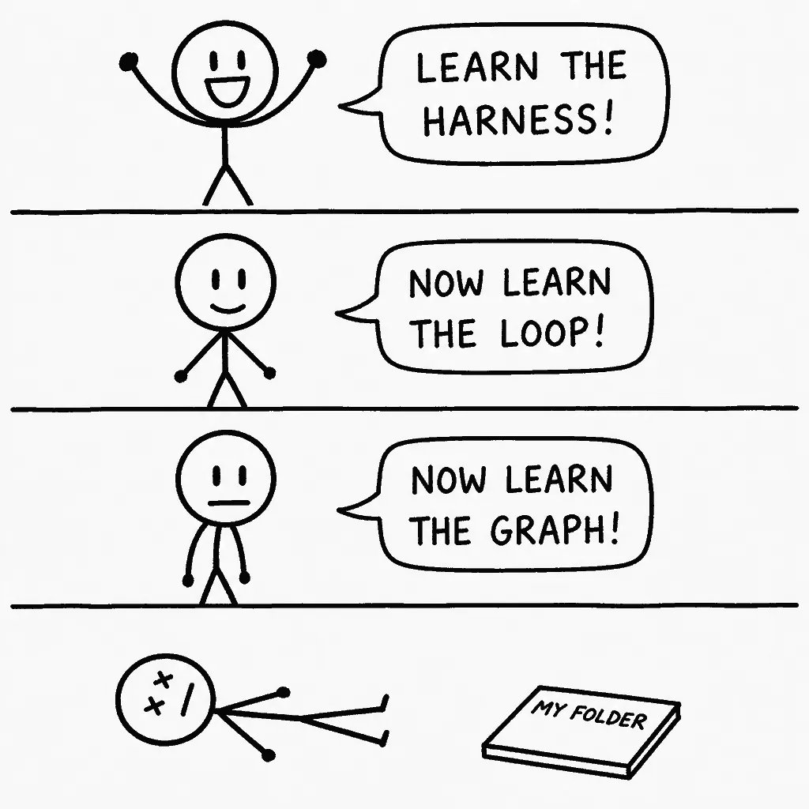

I do this full-time and I still struggle to keep up.

But all of them matter (to certain degrees):

Context. What it can actually see in the window right now. You decide what goes in.

Harness . What you bolt on. The standing rules, the gates and the files it reads before it starts work.

Loop. How you get the AI to QA itself. It goes again until it passes, without you watching.

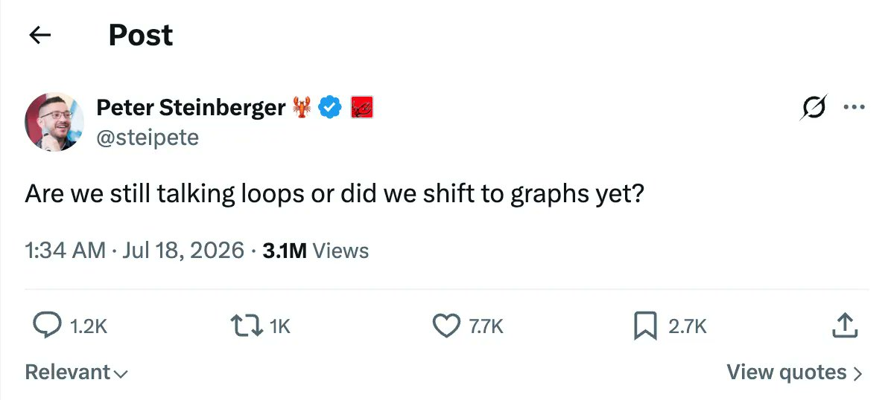

Graph. Where your stuff is and what connects to what. People started calling this graph engineering this summer (the name is new, the problem isn't). That is the one this edition is about.

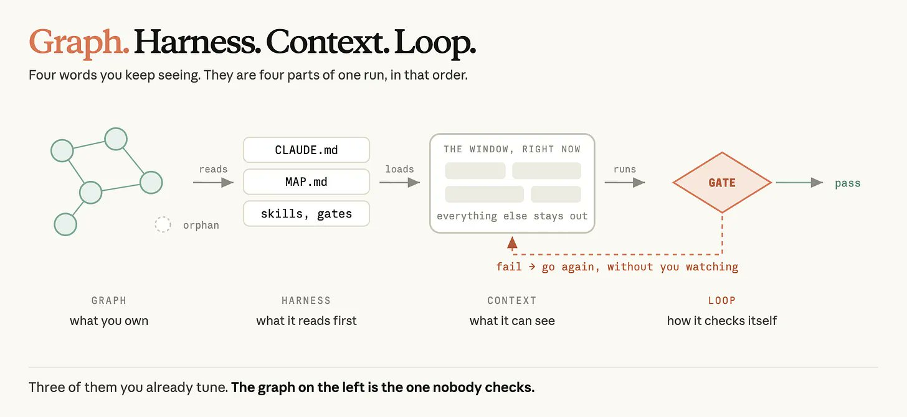

I ignored graphs for months. It was the thing standing between me and the only job I actually wanted done: getting other people into my system without me in the middle of it.

So that is the job I finally did, and it worked.

I've got everyone on my team onto Claude Code now , and some had never used it (Claude Chat at most, not even Cowork). I didn’t do a training day or a call where I explained how it works.

Your team doesn't have to be technical. You just have to give them the system.

It doesn’t matter that they can run it. The memory, the skills and the workflows now get updated by all of us, so a fix one person makes is in everybody's folder the next morning.

But none of this matters if your local setup's messy and you're pushing the wrong stuff to GitHub. Mine was, and I couldn't see it, because from the inside everything looked fine. My folders were readable by me and nobody else.

I spend hours on a newsletter, tell Claude to update the voice file from it, and the next time I ask for a first draft it sounds completely different.

I had dumped everything in. Nothing pointed at anything, so it had no idea which part was the bit that worked.

So I ran the check on my own folders this week (four months later than I should have).

Claude found 2,364 documents, 1,840 with nothing pointing at them.

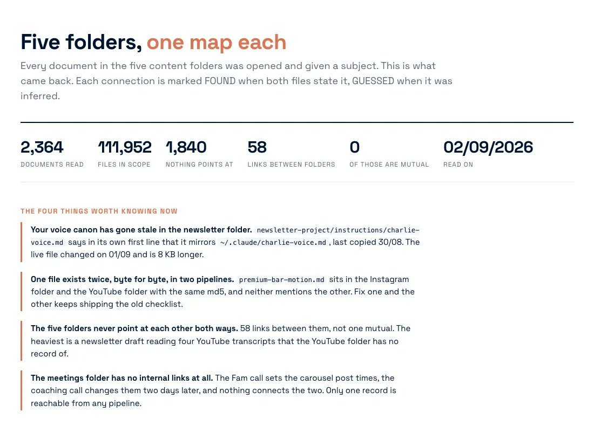

That's 78% my own AI would never reach on its own, and it's the same 78% a new person would never find either. A folder your AI never opened reads exactly like a folder with nothing in it (which is the trap).

### Claude Code folder structure (this comes first)

My content system is laid out one folder per platform. That's architecture.

LinkedIn, Instagram, the newsletter, YouTube. Four folders sitting on my Desktop, and whatever I'm making that day, I make it inside the folder that owns it.

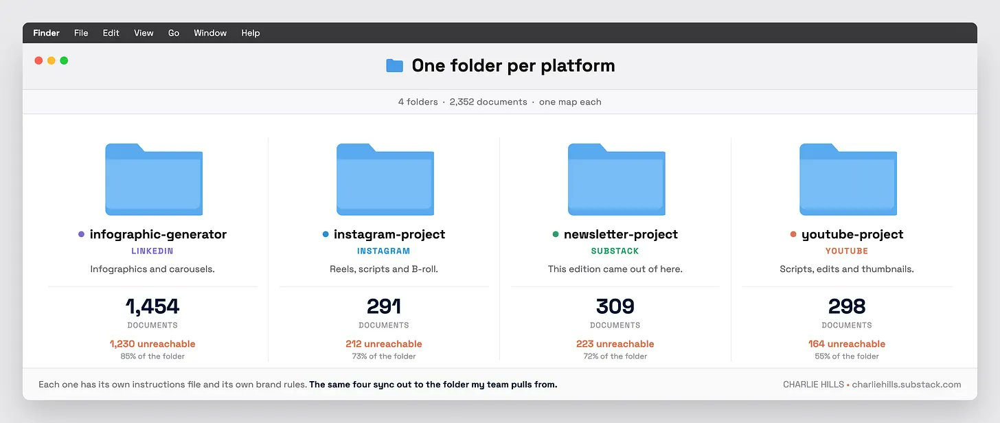

Those same four synced out for the team.

A reel and an infographic have almost nothing in common, so they don't share a folder.

Each one carries its own instructions file, its own brand rules, its own way of working. I open Claude in the folder and it already knows which job it's on, before I've typed a word.

Don’t copy my four folders.

Split it the way your business is already split. Mine is per platform because content is the job I do every day, so that is where the work actually divides.

If you run go-to-market, yours is probably marketing, sales, operations. A one-person shop might be clients, offers, admin. Mirror your org chart, not mine.

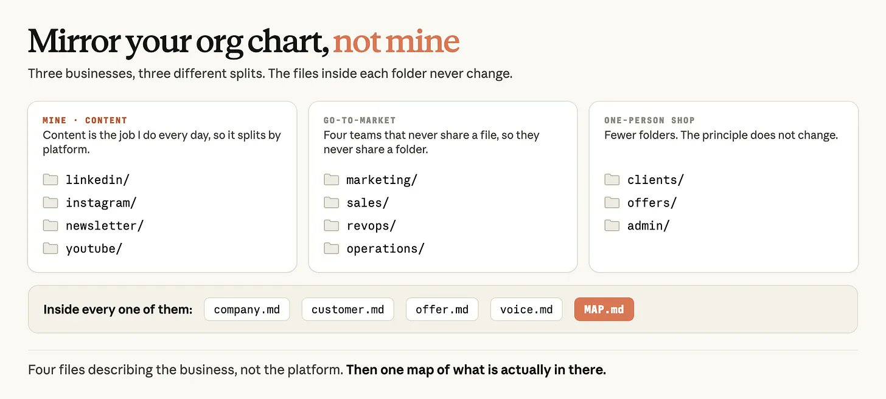

There is no right answer here. The only test is whether two things ever share a file (if they never do, they should never share a folder).

Then the knowledge files go in the folder that uses them.

One of mine sits in all four. It describes the person I write for (my ICP), down to what they already know and what they would scroll straight past.

It’s also why I try not to go too technical.

### Step 1: Draw the map

A folder is just a list of files. What your AI needs is that list plus the lines between the things on it (the lines are the point).

Pick one folder.

Not your whole Desktop, and not a raw export you downloaded once and never opened again. The folder your work actually runs on: client notes, past campaigns, proposals, briefs, meeting notes, transcripts.

If you can't decide, pick the messiest one you open most weeks (mine was the newsletter folder, which is embarrassing).

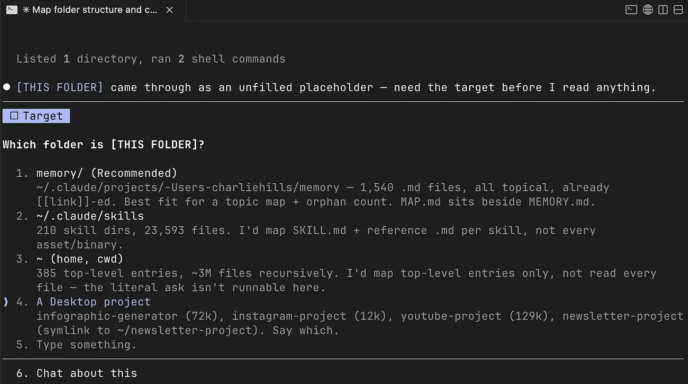

It will not guess. Leave the placeholder in and it asks which folder you mean.

Paste this into Claude Code, in that folder:

> Read every single file in [THIS FOLDER] and build me a map of it. Do not skip any. For each one, work out what it is about and which other files cover the same ground. Then write MAP.md in this folder with four parts. PART ONE: every topic you found, and the files covering it, ranked by how many other files point at it. PART TWO: how many files nothing points at, as a number and as a percentage of the folder. PART THREE: the connections I would not have spotted myself, naming which two files each one joins and why you joined them. PART FOUR: a header saying how many files you read, and today's date. Mark every connection FOUND, meaning both files state it, or GUESSED, meaning you inferred it. Never present a guess as a find. If you cannot tell, mark it GUESSED. From now on, read MAP.md before any job in this folder, and append what you learned when you finish.

It writes one file. MAP.md, sitting in the folder you just pointed it at.

Why do this? Because AI is not deterministic, it is probabilistic. It does not read your files in a fixed order, it makes a call each time about what to look at.

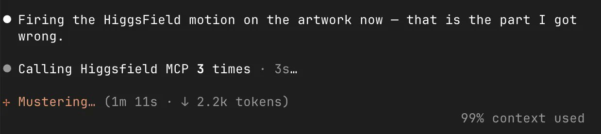

So you can have canons, memories, skills and hooks all set up, and none of them talk to each other. Nothing is broken. There is just no linkage.

The map is the linkage.

Think of it like a Claude Skill: a clear sequential flow, with clear instructions on what follows. The map is that times 100, across everything in the folder.

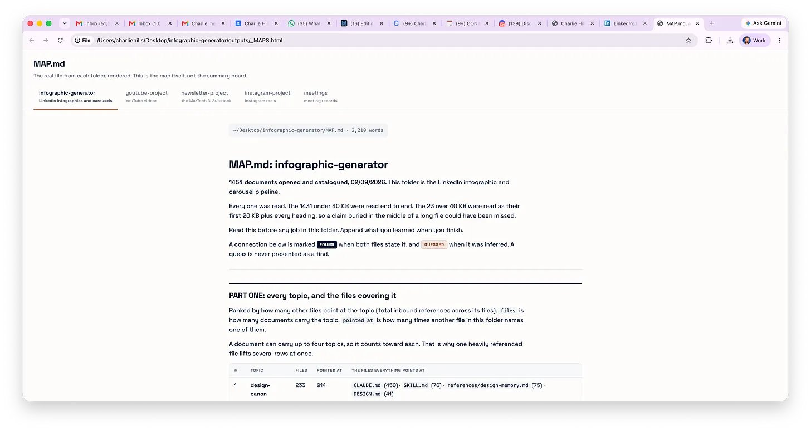

I pointed it at five folders at once and had several readers working in parallel.

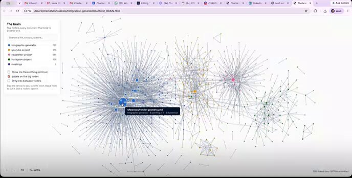
[Video: video-010 - 0:08, 688x348, full video not included in this bundle, poster frame media/video-010.poster.jpg, source link preserved]

I created this graph so you can visualise the connections, but this isn’t useful whatsoever. It just looks pretty.

This is literally my entire content system, every MD file, skill, and thing that I’ve built over the last 6 months of building with Claude Code.

Point it at one folder rather than everything you own, and go and make a coffee.

### Step 2: Read what it hands back

It comes back in three parts, and each one answers a different question.

Part #1: what you actually have

Every topic in the folder, ranked by how many other files point at it.

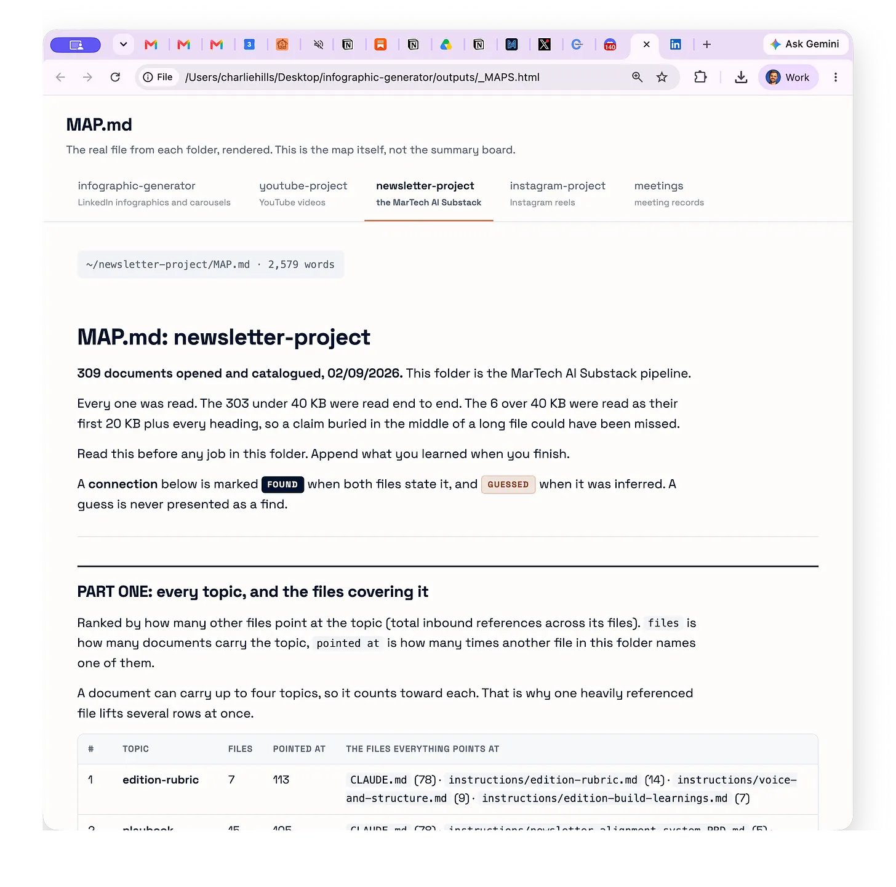

That list is what my folder says I care about. Not what I would have said. My rubric sits at the top on 113 references, and 78 of those come from one file.

Part #2: what nothing points at

223 of my 309 documents are named by nothing else in the folder.

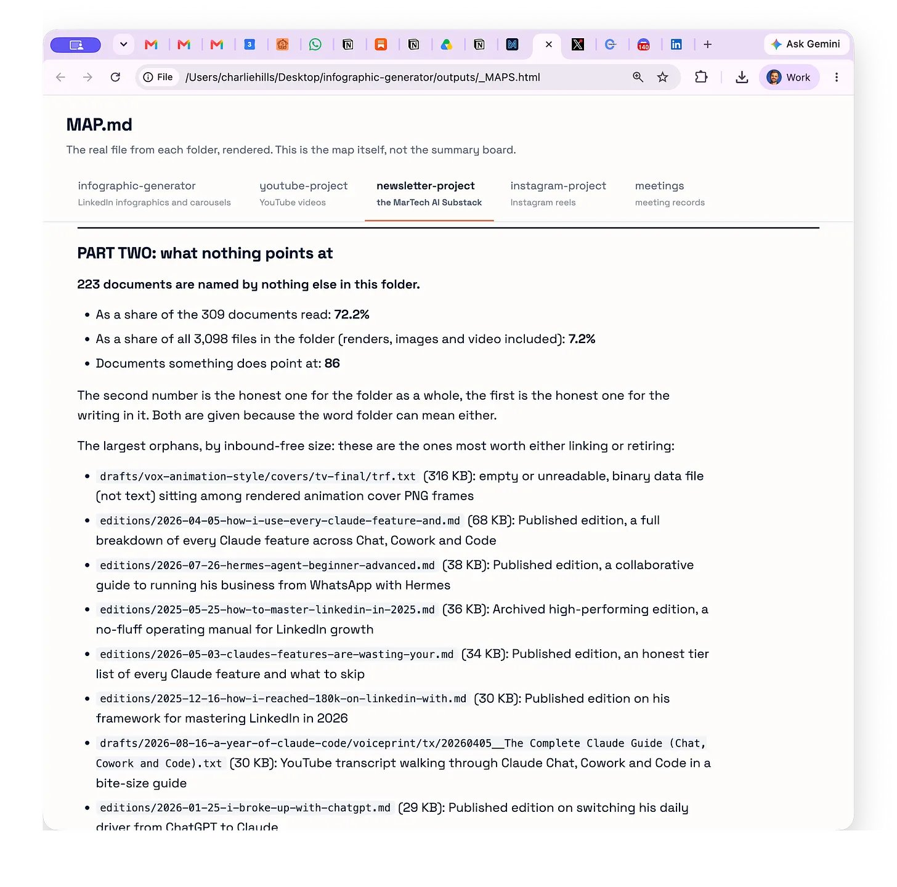

Not lost. Not out of date. Just unreachable, which is the same thing in practice.

Part #3: the problems

Every connection it found, and whether that connection is real.

If two files genuinely mention each other, it marks that FOUND. If it only thinks they go together, it marks that GUESSED.

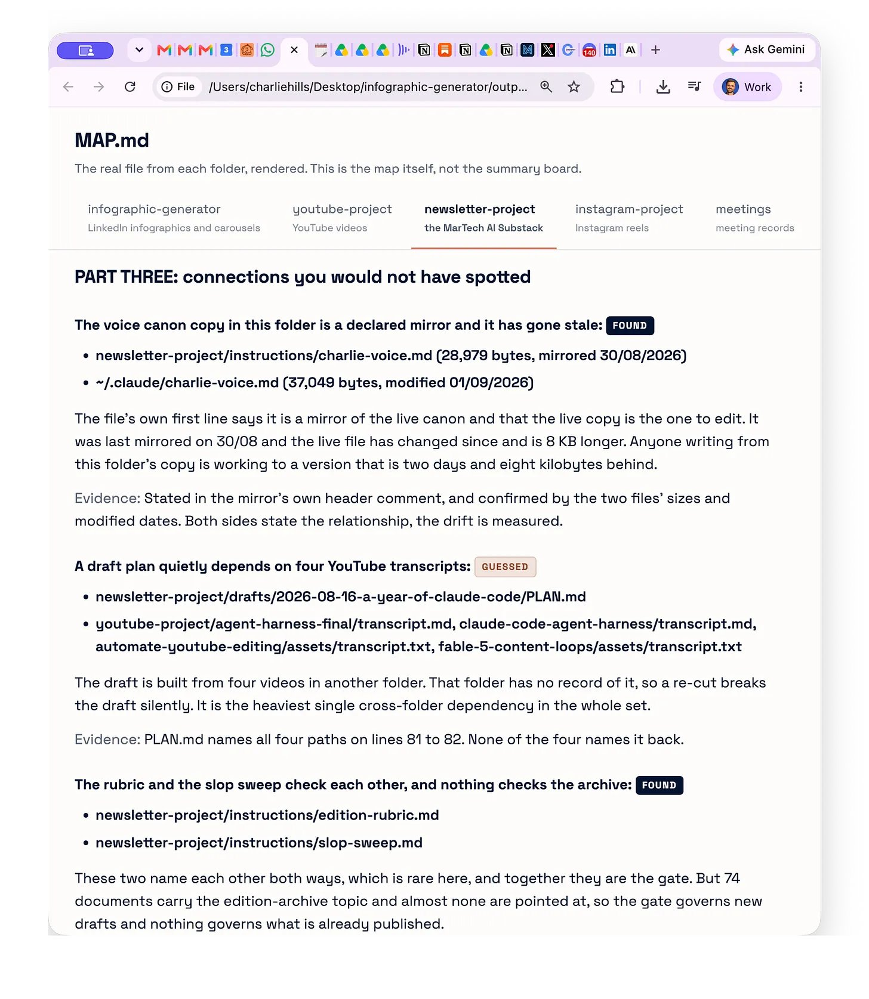

About half of mine came back each way. Without that one word you cannot tell a fact from a hunch, and you end up trusting the hunch.

Three things to look for in yours. I had all three.

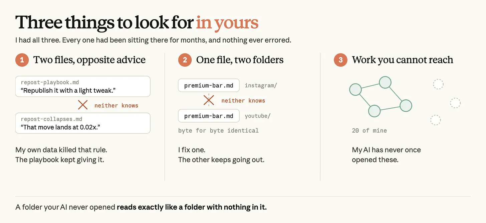

### Step 3: Fix what it found

So there is a third prompt, and it is the one that changes anything.

> Read MAP.md. Take everything in PART THREE. For each one: what breaks if I leave it, and the smallest change that fixes it. Then do the ones I approve. Ask before you touch anything you are not sure about.

It priced every one, did the seven that carried no risk, and stopped on the one that touched something already published.

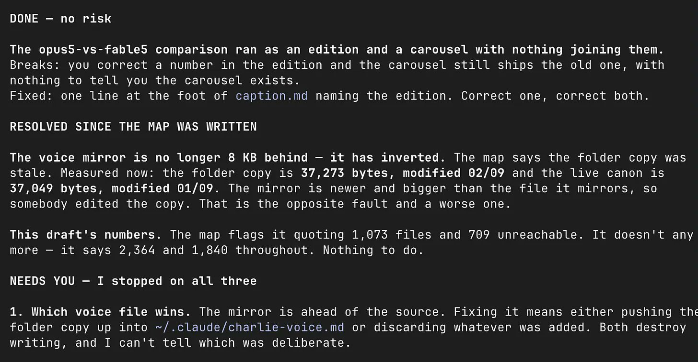

That is the loop.

The map finds it, this prompt prices it, and you approve the ones worth doing.

### Step 4: Make it stick

On its own the map is a report you read once. It becomes the fix the moment something reads it before every job.

So don't paste that in yourself. Get it to do it, which is the fourth prompt:

> Add this line to the top of the CLAUDE.md in each of my folders: READ MAP.md IN THIS FOLDER BEFORE ANY JOB HERE, AND APPEND WHAT YOU LEARNED WHEN YOU FINISH. If a folder hasn't got a CLAUDE.md, make one with that line in it.

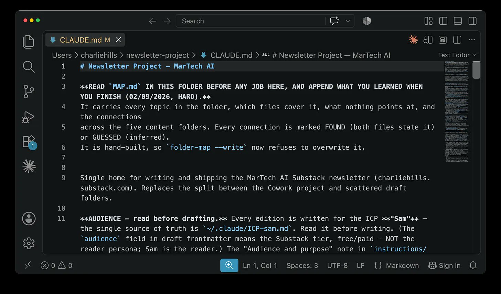

That's it. Four prompts, and the 1,840 files my AI couldn't reach are reachable now, through one file. I never added a pointer by hand.

But this is where it stops being a personal trick.

### Set up your team OS (Claude Code for a non-technical team)

Your team OS is one folder system that everybody pulls from. You keep building in it, and they keep getting the new version.

Which is why the map came first. Push a messy folder and the whole team pulls your mess (and trusts it, because it came from you).

A repo is a folder that lives on GitHub instead of only on your laptop. Connect Claude to your GitHub, then paste this:

> Push these folders to a new private GitHub repo.

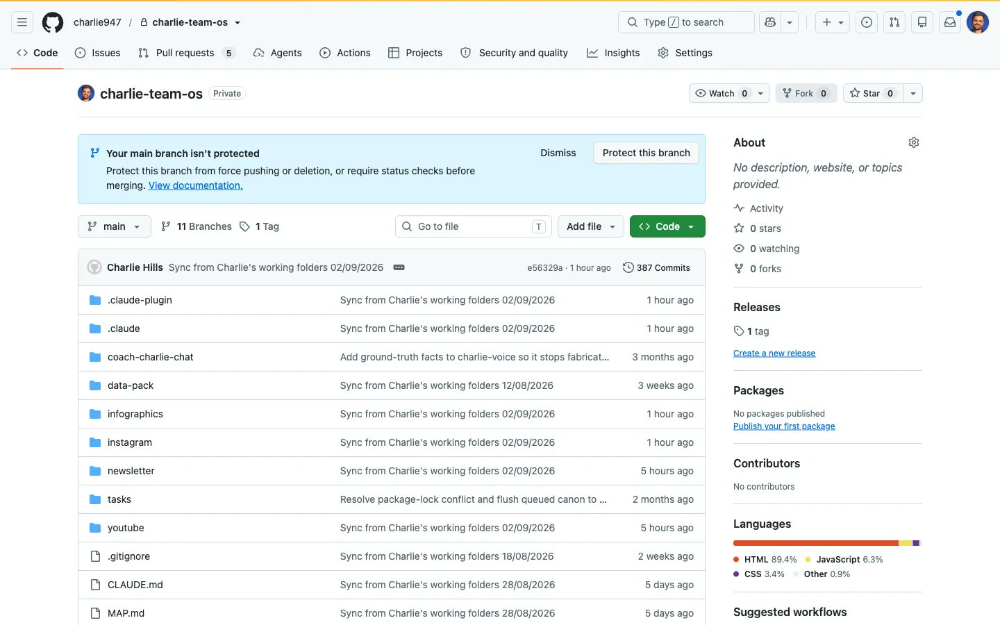

Then invite the people you work with. Keep it private, so only the people you add can see it.

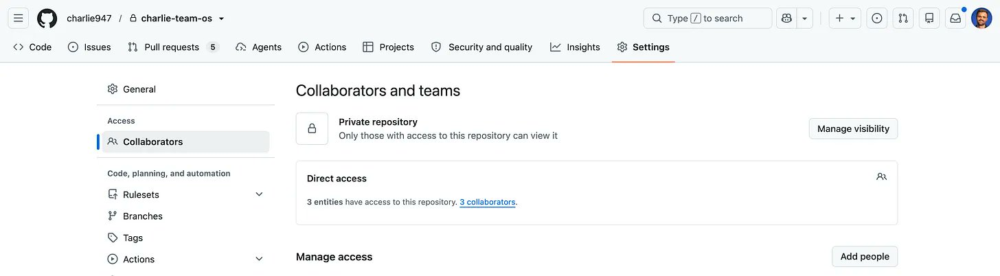

They accept, clone it once, and from then on it's git pull whenever they want the latest. That's the only thing they ever have to type.

That's how you give your team the capabilities you have on your own machine. They aren't just learning your system, they're running it.

And it keeps working because you carry on building. You push, they pull, and what they open on Monday is what you fixed on Friday.

That's how I've been running it, and it's why everyone on my team is on Claude Code now. The only thing ever in the way was how messy my system was.

### Do this tonight

Pick the messiest folder you own. The one your work actually runs on.

Run prompt one and wait it out. Look at the percentage it hands back (mine was 78%, and I do this full time).

Then ask it the one question you'd normally have opened three files to answer.

And if anyone else touches your work, put the map where they can reach it. That's what turns it from a trick you do into something your business runs on.

Not on Claude Code yet? Start there instead , then come back to this.

That's it from me this week. See you again next week.

Stay curious, stay human and keep creating

— Charlie

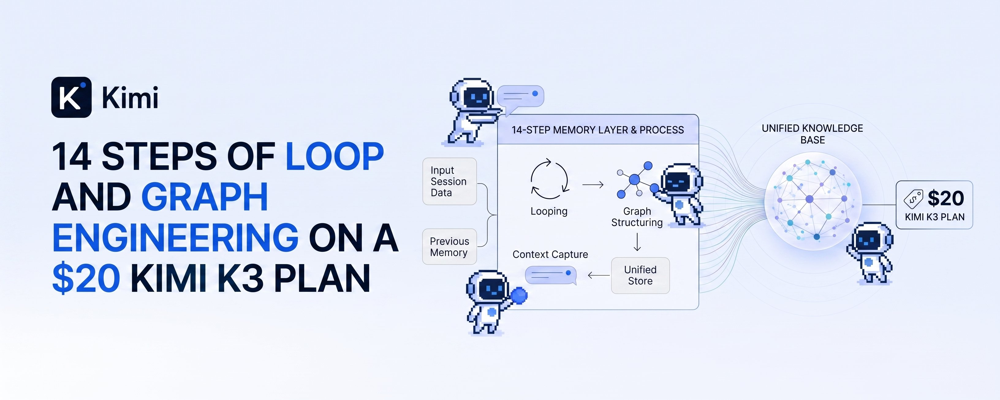

---

## Embedded / Quoted Posts

- None

---

## Duplicate Media

- None

---

## Media References

### Image image-001
- Attached to: main article
- Alt: 图像
- Width: 900
- Height: 900
- MIME: image/jpeg
- File: media/image-001.jpg
- Byte size: 102668
- SHA-256: sha256:279486d4c856633ce8baf505166860cb990e197c7fa1c679dbb79aa344e9fd7c
- Source post ID: 2099082012573552901
- Source URL: https://x.com/charliejhills/status/2099082012573552901
- Original URL: https://pbs.twimg.com/media/HSFruArbIAA45xt?format=jpg&name=orig

### Image image-002
- Attached to: main article
- Alt: 图像
- Width: 900
- Height: 405
- MIME: image/jpeg
- File: media/image-002.jpg
- Byte size: 42699
- SHA-256: sha256:a32f85e143f750bb400b9da2b72dde1043c42bfaaa6583ef3b3f8269aca133ac
- Source post ID: 2099082012573552901
- Source URL: https://x.com/charliejhills/status/2099082012573552901
- Original URL: https://pbs.twimg.com/media/HSFr2KnbcAAPqG8?format=jpg&name=orig

### Image image-003
- Attached to: main article
- Alt: 图像
- Width: 900
- Height: 415
- MIME: image/jpeg
- File: media/image-003.jpg
- Byte size: 70782
- SHA-256: sha256:b9a84893f47d3286e33688f92c77143d0d2a11c392a771ca52c2a6ff6f96cd84
- Source post ID: 2099082012573552901
- Source URL: https://x.com/charliejhills/status/2099082012573552901
- Original URL: https://pbs.twimg.com/media/HSFr8krawAA_mSH?format=jpg&name=orig

### Image image-004
- Attached to: main article
- Alt: 图像
- Width: 900
- Height: 646
- MIME: image/jpeg
- File: media/image-004.jpg
- Byte size: 109602
- SHA-256: sha256:ea021db77cded1f31013850d5fcc3edb8bd92022b8a83450b9e5443dc6946908
- Source post ID: 2099082012573552901
- Source URL: https://x.com/charliejhills/status/2099082012573552901
- Original URL: https://pbs.twimg.com/media/HSFsD_LakAEa6TB?format=jpg&name=orig

### Image image-005
- Attached to: main article
- Alt: 图像
- Width: 900
- Height: 381
- MIME: image/jpeg
- File: media/image-005.jpg
- Byte size: 81222
- SHA-256: sha256:060bbf2b241efdb4f56eca22d73f54bddde766388b96a7ddf3d2b4ad217b25c7
- Source post ID: 2099082012573552901
- Source URL: https://x.com/charliejhills/status/2099082012573552901
- Original URL: https://pbs.twimg.com/media/HSFsL5RbUAA_-9Q?format=jpg&name=orig

### Image image-006
- Attached to: main article
- Alt: 图像
- Width: 900
- Height: 406
- MIME: image/jpeg
- File: media/image-006.jpg
- Byte size: 91891
- SHA-256: sha256:9f55ddf1df29185169b804b10053ad17412573bdf06a5c0aad8ae9114977266b
- Source post ID: 2099082012573552901
- Source URL: https://x.com/charliejhills/status/2099082012573552901
- Original URL: https://pbs.twimg.com/media/HSFsSMnb0AAll-2?format=jpg&name=orig

### Image image-007
- Attached to: main article
- Alt: 图像
- Width: 900
- Height: 504
- MIME: image/jpeg
- File: media/image-007.jpg
- Byte size: 122863
- SHA-256: sha256:4d01953d5bec171c3c1ab914f9622b446b6cd3ce3b9c1fba5ae67dd9f464f87b
- Source post ID: 2099082012573552901
- Source URL: https://x.com/charliejhills/status/2099082012573552901
- Original URL: https://pbs.twimg.com/media/HSFsZCyaUAAc_Eo?format=jpg&name=orig

### Image image-008
- Attached to: main article
- Alt: 图像
- Width: 900
- Height: 202
- MIME: image/jpeg
- File: media/image-008.jpg
- Byte size: 27079
- SHA-256: sha256:86ca9772ecd8f277455ca4217c60f0e24199de4a66e9697d82e2a38c83e9c564
- Source post ID: 2099082012573552901
- Source URL: https://x.com/charliejhills/status/2099082012573552901
- Original URL: https://pbs.twimg.com/media/HSFsr_DaEAA-qIp?format=jpg&name=orig

### Image image-009
- Attached to: main article
- Alt: 图像
- Width: 900
- Height: 478
- MIME: image/jpeg
- File: media/image-009.jpg
- Byte size: 103636
- SHA-256: sha256:832f8e197c6a131c1544005bf4f3aadcebe1d59060116d1c659030ce48836e61
- Source post ID: 2099082012573552901
- Source URL: https://x.com/charliejhills/status/2099082012573552901
- Original URL: https://pbs.twimg.com/media/HSFsx66aIAAdAkx?format=jpg&name=orig

### Video video-010
- Attached to: main article
- Width: 688
- Height: 348
- Status: preserved offline
- Mode: offline-video
- Offline playable: yes
- Duration: 0:08
- MIME: video/mp4
- Poster captured: yes
- Source link preserved: yes
- Full video: not included in this bundle (an LLM cannot watch video); see source link
- Poster frame: media/video-010.poster.jpg
- Transcript: unavailable
- Keyframe description: unavailable
- Byte size: 627125
- SHA-256: sha256:75f579aea1d97a915fa6c6479534a8d908eca2074551c299e11ec035c4f6d993
- Source post ID: 2099082012573552901
- Source URL: https://x.com/charliejhills/status/2099082012573552901
- Original URL: https://video.twimg.com/amplify_video/2099078812273451008/vid/avc1/688x348/FN-UfrOth2faaBtf.mp4?tag=29

### Image image-011
- Attached to: main article
- Alt: 图像
- Width: 900
- Height: 890
- MIME: image/jpeg
- File: media/image-011.jpg
- Byte size: 220109
- SHA-256: sha256:cd9015dd7cb621e0813e049d02b37fe90c91fb89b7e45b24546392c5c2b095a3
- Source post ID: 2099082012573552901
- Source URL: https://x.com/charliejhills/status/2099082012573552901
- Original URL: https://pbs.twimg.com/media/HSFtMaQaoAAwl3A?format=jpg&name=orig

### Image image-012
- Attached to: main article
- Alt: 图像
- Width: 900
- Height: 890
- MIME: image/jpeg
- File: media/image-012.jpg
- Byte size: 272003
- SHA-256: sha256:460307d339e88073464b11771e1c04b7530cfe06ea606498c67be66014516af3
- Source post ID: 2099082012573552901
- Source URL: https://x.com/charliejhills/status/2099082012573552901
- Original URL: https://pbs.twimg.com/media/HSFtTGra8AA_0el?format=jpg&name=orig

### Image image-013
- Attached to: main article
- Alt: 图像
- Width: 782
- Height: 900
- MIME: image/jpeg
- File: media/image-013.jpg
- Byte size: 318660
- SHA-256: sha256:36e012aa44bcc5acf55140adf4807fb95275e8ee41a852a448b40d29058c2ab9
- Source post ID: 2099082012573552901
- Source URL: https://x.com/charliejhills/status/2099082012573552901
- Original URL: https://pbs.twimg.com/media/HSFtcxRbEAAc8k8?format=jpg&name=orig

### Image image-014
- Attached to: main article
- Alt: 图像
- Width: 900
- Height: 415
- MIME: image/jpeg
- File: media/image-014.jpg
- Byte size: 90373
- SHA-256: sha256:b6f29ac33354ee364a7743127cdd272e71f6b119402190ee2d667ae5886b7283
- Source post ID: 2099082012573552901
- Source URL: https://x.com/charliejhills/status/2099082012573552901
- Original URL: https://pbs.twimg.com/media/HSFtuZ0bUAArXFm?format=jpg&name=orig

### Image image-015
- Attached to: main article
- Alt: 图像
- Width: 900
- Height: 468
- MIME: image/jpeg
- File: media/image-015.jpg
- Byte size: 174067
- SHA-256: sha256:ae2b67f4991e5c0baea6ec0a143018ca43b755aaba8c8aa819c2a7193fe94c26
- Source post ID: 2099082012573552901
- Source URL: https://x.com/charliejhills/status/2099082012573552901
- Original URL: https://pbs.twimg.com/media/HSFuDSuaEAA0A66?format=jpg&name=orig

### Image image-016
- Attached to: main article
- Alt: 图像
- Width: 900
- Height: 529
- MIME: image/jpeg
- File: media/image-016.jpg
- Byte size: 165141
- SHA-256: sha256:5479e55f66f087c44d87adb67f5483ffee63054113902fb915d6af072ca67048
- Source post ID: 2099082012573552901
- Source URL: https://x.com/charliejhills/status/2099082012573552901
- Original URL: https://pbs.twimg.com/media/HSFuRIDa0AA9Gon?format=jpg&name=orig

### Image image-017
- Attached to: main article
- Alt: 图像
- Width: 900
- Height: 563
- MIME: image/jpeg
- File: media/image-017.jpg
- Byte size: 150143
- SHA-256: sha256:6b7b8e37001ff48a5b3c9d3e73fd1b1d40f3268a46ed30ecab1df1911870bf0c
- Source post ID: 2099082012573552901
- Source URL: https://x.com/charliejhills/status/2099082012573552901
- Original URL: https://pbs.twimg.com/media/HSFuzFDbEAAIGOW?format=jpg&name=orig

### Image image-018
- Attached to: main article
- Alt: 图像
- Width: 900
- Height: 248
- MIME: image/jpeg
- File: media/image-018.jpg
- Byte size: 46800
- SHA-256: sha256:b0ec1ad3a288bac2b78051296ab66dddc8b548b967562738987990bbacf764f8
- Source post ID: 2099082012573552901
- Source URL: https://x.com/charliejhills/status/2099082012573552901
- Original URL: https://pbs.twimg.com/media/HSFvE1UbwAAkPWo?format=jpg&name=orig

### Image image-019
- Attached to: main article
- Alt: Image attached to main X article by @charliejhills, archive media image-019
- Width: 120
- Height: 120
- MIME: image/jpeg
- File: media/image-019.jpg
- Byte size: 141520
- SHA-256: sha256:3b57ea59ef3767e18641a0a0a8fc1587c9f00cfd393f9023e7a9d060db513e94
- Source post ID: 2099082012573552901
- Source URL: https://x.com/charliejhills/status/2099082012573552901
- Original URL: https://pbs.twimg.com/media/HR1nQ6WaEAA3laf?format=jpg&name=orig

### Image image-020
- Attached to: main article
- Alt: 文章封面图片
- Width: 680
- Height: 272
- MIME: image/jpeg
- File: media/image-020.jpg
- Byte size: 284774
- SHA-256: sha256:fdf32e7bc5fa35473ec0ce644ac870b6e37d022c9916df863b61c7b426c437b4
- Source post ID: 2099082012573552901
- Source URL: https://x.com/charliejhills/status/2099082012573552901
- Original URL: https://pbs.twimg.com/media/HRbZkFHaYAA7CAk?format=jpg&name=orig

---

## Missing / Incomplete Content

- None

---

## Source Links

1. https://x.com/charliejhills/status/2099082012573552901
2. https://charliehills.substack.com/p/wait-your-claude-doesnt-have-a-harness
3. https://charliehills.substack.com/p/give-me-10-minutes-ill-teach-you
